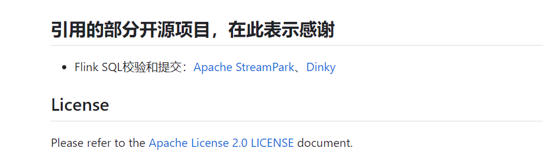

## 审查结果及致歉


开源社区的朋友们大家好：

  由于审核不严，我们在使用开源项目 Apache StreamPark 和 Dinky 部分源码的时候没有正确按照规范进行开源协议声明，由此给 Apache StreamPark 和 Dinky 带来的影响我们深感抱歉！

  经过初步核实，赤兔实时计算平台共开源了 114866 行代码，其中 9938 行代码使用到了 Apache StreamPark 和 Dinky 的源代码，如下所示：
```
com.chitu.bigdata.sdp.flink.common包: 2770行
com.chitu.bigdata.sdp.flink.submit包: 2925行
com.chitu.bigdata.sdp.flink.client包: 331行
com.chitu.bigdata.sdp.service.validate包: 3912行
合计占总代码行数的 8.7% (9938 / 114866)
```
  根据 Apache StreamPark 的要求：
```
1.  copy 的源码必须遵守 Apache-2.0 license 的合规要求，保留 Apache-2.0 License Header，声明来源
2.  公开回应，并且道歉，消除影响，合规使用开源代码
```

  我们初步采取了以下措施：
1. 对使用到的 Apache StreamPark 和 Dinky 源代码加上了开源协议声明，如：  
https://github.com/galaxy-data-cn/chitu-sdp/blob/master/chitu-sdp-flink/chitu-sdp-flink-submit-1.14/src/main/java/com/chitu/bigdata/sdp/flink/submit/service/FlinkSubmit.scala  
https://github.com/galaxy-data-cn/chitu-sdp/blob/master/chitu-sdp-flink/chitu-sdp-flink-common/src/main/java/com/chitu/bigdata/sdp/flink/common/util/Logger.scala  
...  
(共 92 个文件)

2. 在 GitHub 的 README 中声明了代码来源：  


  赤兔实时计算平台于 23年 3月开源，本意是想共享赤兔实时计算能力，让更多的同学能快速开发和管理实时计算任务，同时通过分享源代码与开源社区的朋友们一起学习进步。但是我们在研发过程中，没有充分尊重开源规则，辜负了大家的信任。后续我们会适时关闭整改项目，很抱歉给各位辛苦付出努力的开源人带来的伤害。期望大家一如既往支持开源事业。

<p align="right">赤兔实时计算团队-商渭清</p>
